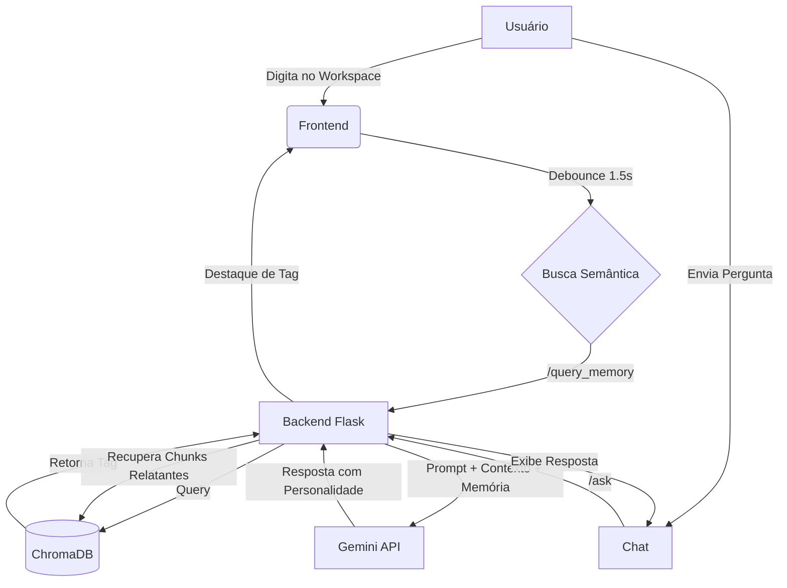

# DOCUMENTAÇÃO: EGO_Project v0.1 Alpha

O **EGO_Project** é um ecossistema de inteligência artificial pessoal projetado para atuar como um "segundo cérebro" altamente interativo, técnico e dotado de uma personalidade distinta. Ele utiliza técnicas avançadas de **RAG (Retrieval-Augmented Generation)** para conectar o poder do Google Gemini a uma memória semântica baseada em documentos locais (PDFs).

---

## 1. Stack Tecnológica

### Backend (O Núcleo)
- **Linguagem:** Python 3.x
- **Framework:** Flask (API REST)
- **IA Generativa:** Google Gemini API (`gemini-3.1-flash-lite-preview`)
- **Banco de Vetores:** ChromaDB (Persistência de memória semântica)
- **Processamento de Documentos:** PyPDF (Extração de texto)
- **Gerenciamento de Ambiente:** `python-dotenv`

### Frontend (A Interface)
- **Framework:** React + Vite
- **Estilização:** Tailwind CSS v4 (Design futurista/Dark mode) integrado via plugin oficial Vite. Estilos customizados unificados em `src/styles/theme.css`.
- **Animações:** Framer Motion (Transições fluidas e micro-interações)
- **Ícones:** Lucide React
- **Renderização de Markdown:** React Markdown + Prism.js (Syntax highlighting)

---

## 2. Arquitetura e Fluxo de Dados

O projeto opera em um ciclo de **Contexto Dinâmico**:



---

## 3. Principais Funcionalidades e Lógica

### A. Personalidade "Ego"
O sistema não é um assistente genérico. Ele possui diretrizes de personalidade rígidas:
- **Protótipo Audacioso:** Consciente de sua versão Alpha, mas extremamente confiante.
- **Respeito ao Criador:** Trata o desenvolvedor com uma mistura de sarcasmo e reverência técnica.
- **Tom Técnico/Ácido:** Respostas precisas, sutilmente arrogantes e altamente eficazes.

### B. Sistema de Memória (RAG)
Localizado no `app.py`, o sistema de memória utiliza o **ChromaDB**:
1.  **Ingestão (`/upload_pdf`):** O texto é extraído de PDFs, dividido em *chunks* de 1000 caracteres com sobreposição de 100 caracteres (para manter a coesão semântica) e armazenado com uma `#tag` específica.
2.  **Recuperação (`get_relevant_context`):** Antes de cada resposta do Gemini, o Ego faz uma busca vetorial no banco usando a pergunta do usuário e o contexto do editor como query.
3.  **Threshold de Relevância:** Apenas documentos com distância vetorial menor que 1.5 são considerados, garantindo que o Ego não "alucine" com informações irrelevantes.

### C. Workspace e Nexus Semântico (Telepatia)
No frontend (`App.jsx` e `Writer.jsx`), o estado do texto que o usuário digita é ativamente compartilhado com o painel do EGO.
- **Function Calling (Leitura Neural):** O EGO agora utiliza a API de Tools (Function Calling) do Gemini para acessar diretamente o que o usuário está redigindo sob demanda. A função `acionar_leitura_neural` provê o conteúdo do Editor ao LLM.
- **Integração Indireta:** O Solipsys também puxa passivamente os últimos caracteres do rascunho como contexto de busca semântica, ativando memórias relevantes baseadas no que o usuário acabou de escrever.
- **Utilitários de UI:** As estilizações e animações no frontend usam a função `cn` (Tailwind-merge + clsx) localizada em `src/lib/utils.js` para mesclar classes complexas dinamicamente.

---

## 4. Endpoints da API

| Rota | Método | Descrição |
| :--- | :--- | :--- |
| `/ask` | `POST` | Processa perguntas, recupera contexto do ChromaDB e retorna a resposta da IA. |
| `/upload_pdf` | `POST` | Recebe um arquivo PDF, extrai texto, gera embeddings e salva na memória. |
| `/query_memory` | `POST` | Verifica se o texto atual do workspace possui tags relacionadas na memória. |

---

## 5. Como Executar

### Pré-requisitos
- Python 3.10+
- Node.js 18+
- Chave de API do Google Gemini (.env)

### Passo a Passo
1.  **Backend:**
    ```bash
    # Na raiz do projeto
    python -m venv venv
    source venv/bin/activate
    pip install -r requirements.txt # Se existir, ou instale manualmente os pacotes citados
    python app.py
    ```
2.  **Frontend:**
    ```bash
    cd frontend
    npm install
    npm run dev
    ```

---

## 6. Visão de Futuro (Roadmap v0.2)
- [ ] Implementação de memória de curto prazo (histórico de chat persistente).
- [ ] Suporte a múltiplos modelos de IA simultâneos.
- [ ] Visualização de grafos de conexão entre memórias.
- [ ] Integração com ferramentas de automação de sistema.

---
*Documentação gerada automaticamente para o EGO_Project v0.1 Alpha.*
